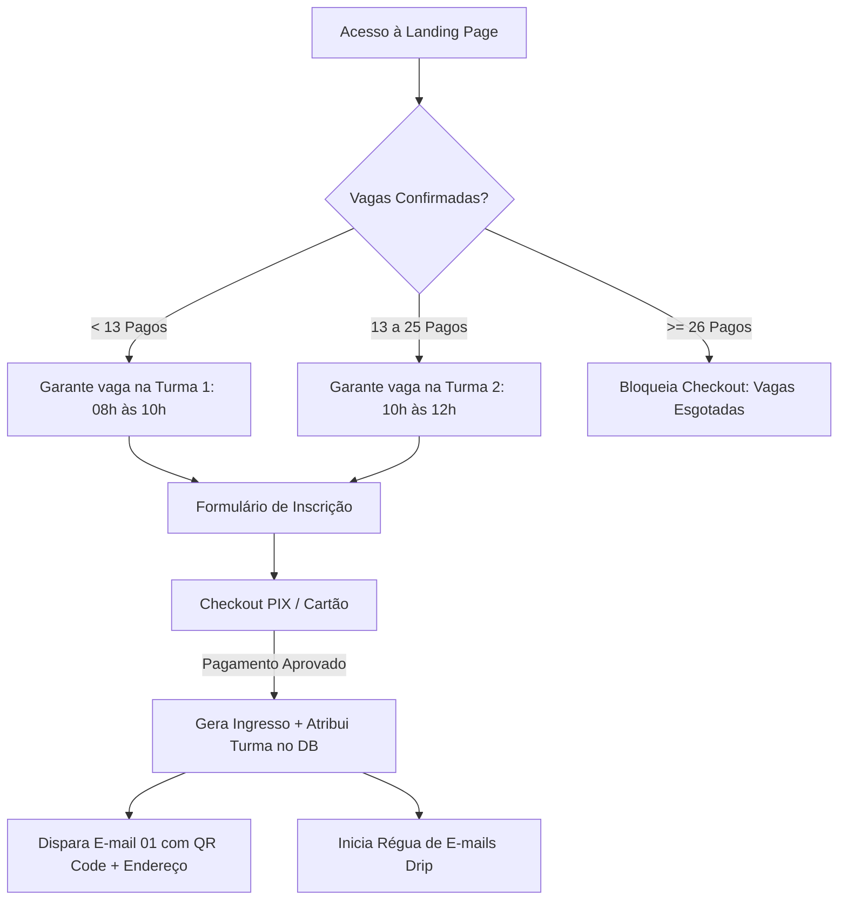

# Planejamento Diretor: Intensivão ENEM Medicina 2026 (Presencial Manaus)

Este documento estabelece o planejamento completo, técnico, financeiro, pedagógico, de marketing de resposta direta e de arquitetura de software para o **Intensivão ENEM Medicina 2026** no ecossistema **Aprova+**.

---

## 📌 1. Visão Geral do Evento

| Parâmetro               | Detalhe                                                                                                     |
| :---------------------- | :---------------------------------------------------------------------------------------------------------- |
| **Evento**              | Intensivão ENEM 2026 — Foco Medicina                                                                        |
| **Formato**             | Presencial (4 Sábados de Imersão, 2h por sábado)                                                            |
| **Local**               | **Open Laranjeiras Gallery**                                                                                |
| **Endereço**            | Av. Prof. Nilton Lins, 1984 – Flores, Manaus - AM, 69058-300                                                |
| **Contato Oficial**     | WhatsApp: (92) 98158-1955 (Prof. Júnior)                                                                    |
| **Preço**               | R$ 500,00 (à vista no PIX ou em até 12x no Cartão de Crédito)                                               |
| **Capacidade Máxima**   | **26 Alunos** (2 turmas de 13 alunos)                                                                       |
| **Divisão de Horários** | Cada turma tem 2h de aula: 1h de Física + 1h de Matemática. A ordem das disciplinas alterna entre as salas. |
| **Encerramento**        | Automático ao confirmar o 26º pagamento (Exibição de _Vagas Esgotadas_)                                     |

---

## 💰 2. Análise Financeira Detalhada: Quanto Sobra no Bolso?

Comparativo para **Pessoa Física (CPF - sem CNPJ)** entre **Mercado Pago** e **Asaas**, considerando o cenário de 50% das vendas no PIX e 50% no Cartão de Crédito.

### 📊 Cenário Oficial: Capacidade Esgotada (26 Alunos)

- **Faturamento Bruto:** 26 × R$ 500,00 = **R$ 13.000,00**
- 13 Vendas via PIX: R$ 6.500,00
- 13 Vendas via Cartão: R$ 6.500,00

| Gateway                 |             Taxa PIX             |            Taxa Cartão             | Custo Total de Taxas | 💰 Sobra Líquida no Bolso |    Prazo de Liberação     |
| :---------------------- | :------------------------------: | :--------------------------------: | :------------------: | :-----------------------: | :-----------------------: |
| **Mercado Pago (D+0)**  | 0,99% (R$ 4,95/venda) = R$ 64,35 | 4,99% (R$ 24,95/venda) = R$ 324,35 |    **R$ 388,70**     |     **R$ 12.611,30**      |      Imediato (D+0)       |
| **Mercado Pago (D+14)** | 0,99% (R$ 4,95/venda) = R$ 64,35 | 3,99% (R$ 19,95/venda) = R$ 259,35 |    **R$ 323,70**     |     **R$ 12.676,30**      |          14 dias          |
| **Asaas (D+30)**        |  R$ 1,99 fixo/venda = R$ 25,87   |    2,99% + R$ 0,49 = R$ 200,72     |    **R$ 226,59**     |     **R$ 12.773,41**      | PIX na hora / Cartão D+30 |

_(Se comparado a plataformas fechadas como a Sympla que cobra 10%, você pagaria R$ 1.300,00 em taxas. Usando gateway próprio, a economia direta é de mais de **R$ 1.000,00**)._

### 📊 Cenário Alternativo (30 Alunos)

- **Faturamento Bruto:** 30 × R$ 500,00 = **R$ 15.000,00** (15 PIX / 15 Cartão)
- **Mercado Pago (D+0):** Taxas de R$ 448,50 ➔ 💰 **Líquido: R$ 14.551,50**
- **Asaas (D+30):** Taxas de R$ 261,45 ➔ 💰 **Líquido: R$ 14.738,55**

> **💡 Veredito Financeiro:**
>
> - **Se você precisa do dinheiro do cartão na hora para cobrir custos de material e coffee-break:** O **Mercado Pago D+0** é o campeão (liberação imediata com apenas R$ 388 de custo total).
> - **Se você pode esperar 30 dias para sacar a parte do cartão:** O **Asaas** economiza R$ 162 adicionais em taxas.

---

## 🧠 3. Engenharia de Marketing e Conversão

A estratégia de persuasão e cópia da Landing Page foi desenhada a partir das referências fundamentais de marketing e psicologia de decisão:

```
┌─────────────────────────────────────────────────────────────────────────────┐
│ ESTRUTURA METODOLÓGICA DE PERSUASÃO                                         │
│                                                                             │
│ 1. Alex Hormozi ($100M Offers)        → Equação de Valor & Grandiosa Oferta │
│ 2. Robert Cialdini (Armas da Persuasão) → Escassez Real (26 Vagas) + Prova    │
│ 3. Eugene Schwartz (Breakthrough Adv.) → Nível Solution-Aware (Dor da TRI)  │
│ 4. Blair Warren (One-Sentence)         → Justificar o Fracasso Anterior     │
└─────────────────────────────────────────────────────────────────────────────┘
```

### 1. A Equação de Valor de Alex Hormozi (_$100M Offers_)

$$\text{Valor Percebido} = \frac{\text{Aprovação em Medicina (Sonho)} \times \text{Certeza no Método do Prof. Júnior}}{\text{4 Sábados (Tempo Curto)} \times \text{Zero Enrolação / Foco Cirúrgico na TRI}}$$

### 2. O Stack de Valor Ancorado (Offer Stacking)

Para tornar os **R$ 500,00** um "no-brainer" (uma escolha óbvia e irresistível):

| Entregável                                                                   |        Valor de Mercado Individual         |
| :--------------------------------------------------------------------------- | :----------------------------------------: |
| **4 Sábados de Imersão Presencial (1h Física + 1h Matemática por encontro)** |                 R$ 750,00                  |
| **Apostila Física de Questões Comentadas & Padrões Recorrentes**             |                 R$ 197,00                  |
| **Mapas Mentais dos Tópicos Mais Importantes para Medicina**                 |                 R$ 197,00                  |
| **Acesso ao Grupo VIP no WhatsApp com Prof. Júnior até o ENEM**              |                 R$ 297,00                  |
| **VALOR TOTAL REAL ACUMULADO:**                                              |            **~~R$ 1.441,00~~**             |
| **INVESTIMENTO DO LOTE 1 (26 Vagas):**                                       | **R$ 500,00 à vista (ou 12x de R$ 49,90)** |

### 3. As 3 Âncoras de Preço (Custo da Inação)

1. **Âncora da Faculdade Particular:** Uma faculdade de Medicina custa ~R$ 12.000/mês (> R$ 850.000 no curso). R$ 500 para garantir a vaga na UFAM/UEA economiza uma fortuna para a família.
2. **Âncora do Ano Perdido:** Mais um ano de cursinho tradicional em Manaus custa R$ 15.000/ano. O intensivão custa menos de meia mensalidade de cursinho.
3. **Âncora Diária:** R$ 1,65 por dia durante o ano.

### 4. Psicologia da Dupla Audiência (Pais vs. Alunos)

- **Para o Aluno:** Fim da insegurança de "estudar muito e não sair dos 700 pontos na TRI", clareza de quais questões priorizar no dia da prova, sensação de estar em uma turma de elite.
- **Para os Pais:** Segurança do investimento, apoio pedagógico de alto nível em Manaus, ambiente presencial controlado e de excelência.

---

## ⚙️ 4. Regras de Negócio e Alocação de Turmas



### Regras Estritas do Sistema:

1. **Capacidade por Turma:** Exatamente **13 alunos**.
2. **Alocação Automática:**
   - Alunos aprovados **#01 a #13** ➔ **Turma 1 (08:00 às 10:00)**.
   - Alunos aprovados **#14 a #26** ➔ **Turma 2 (10:00 às 12:00)**.
3. **Escassez em Tempo Real na LP:**
   - Exibir badge dinâmico: _"Restam apenas X de 26 vagas!"_.
   - Quando atingir 13 vagas: _"Turma da manhã 100% preenchida! Últimas vagas para a Turma da tarde (10h às 12h)"_.
4. **Fechamento do Checkout:**
   - Ao confirmar 26 pagamentos, o botão de compra é desativado e substituído por: _"Vagas Esgotadas — Deseja entrar na lista de espera para a próxima turma?"_.

---

## 📋 5. Formulário de Inscrição

O formulário coleta as informações vitais sem gerar fricção excessiva:

1. **Nome Completo do Aluno** _(Obrigatório — para crachá e lista de presença)_
2. **E-mail do Aluno/Responsável** _(Obrigatório — onde o ingresso e QR Code chegam)_
3. **WhatsApp com DDD** _(Obrigatório — para lembretes e grupo VIP)_
4. **CPF do Aluno** _(Obrigatório — para credenciamento e emissão do pagamento)_
5. **Data de Nascimento / Idade** _(Obrigatório)_
6. **Série / Situação Atual** _(Dropdown obrigatório)_:
   - 1º ano do Ensino Médio
   - 2º ano do Ensino Médio
   - 3º ano do Ensino Médio
   - Já concluí o Ensino Médio
7. **Nome do Responsável & WhatsApp do Responsável** _(Exibido se idade < 18 anos)_
8. **Observações / Informações Adicionais** _(Opcional)_

---

## 📬 6. Régua de E-mails Automáticos (Drip Campaign)

Usando o **Resend** já integrado ao Aprova+, o aluno e o responsável receberão uma sequência programada de alto valor:

```
[D-0] Confirmação Imediata & Cartão de Embarque (QR Code, Turma e Local)
  │
[D+2] Guia Prático: "Como se preparar para o Sábado 1 + Material Pré-Aula"
  │
[D+4] Mensagem Pessoal do Prof. Júnior (Vídeo exclusivo e boas-vindas)
  │
[D+6] O Mapa da TRI de Medicina (Diagnóstico dos erros mais comuns no ENEM)
  │
[2 Dias antes do Sábado 1] Checklist Operacional (O que levar, endereço e pontualidade)
  │
[Sábado 1 Concluído] Devolutiva do Dia 1 + Gabaritos e Metas para o Sábado 2
  │
[Sábado 2 Concluído] Devolutiva do Dia 2 + Ajustes de Reta Final
  │
[Pós-Evento] Certificado de Participação + Acesso Contínuo à Mentoria
```

---

## 📊 7. Sistema de Tracking Próprio no Banco (Sem PostHog)

Para manter a aplicação leve, sem custos de ferramentas de terceiros e com privacidade total, o rastreamento será feito diretamente no Supabase:

### Tabela de Rastreamento Simples (`evento_page_views` / `evento_analytics`)

Registra cada etapa do funil:

- `page_view` (com `utm_source`, `utm_medium`, `utm_campaign`, `referrer`)
- `cta_clicked`
- `form_started`
- `form_submitted`
- `pix_generated` / `card_started`
- `payment_approved`

### Painel Admin no `apps/app` (`/admin/eventos/intensivao-medicina`)

Exibição limpa em cards e gráficos:

- **Taxa de Conversão da LP:** (Visitantes ➔ Formulários ➔ Pagamentos)
- **Vagas Ocupadas em Tempo Real:** (Turma 1: 13/13 | Turma 2: X/13 | Total: Y/26)
- **Faturamento Acumulado:** Total Bruto e Líquido estimado
- **Origem dos Alunos:** Principais canais (Instagram Ads, WhatsApp, Direto)
- **Lista de Inscritos:** Tabela com busca, status, turma alocada, e botão de reenvio de ingresso.
- **Check-in Rápido:** Leitor ou botão para validar a presença nos 3 sábados.

---

## 🗄️ 8. Modelagem de Banco de Dados (Supabase Migration)

```sql
-- 1. Tabela de Eventos
CREATE TABLE IF NOT EXISTS public.eventos (
    id UUID PRIMARY KEY DEFAULT gen_random_uuid(),
    slug TEXT UNIQUE NOT NULL,
    titulo TEXT NOT NULL,
    preco_centavos INTEGER NOT NULL DEFAULT 50000,
    limite_total_vagas INTEGER NOT NULL DEFAULT 26,
    capacidade_por_turma INTEGER NOT NULL DEFAULT 13,
    local_nome TEXT NOT NULL DEFAULT 'Open Laranjeiras Gallery',
    local_endereco TEXT NOT NULL DEFAULT 'Av. Prof. Nilton Lins, 1984 – Flores, Manaus - AM, 69058-300',
    local_contato TEXT NOT NULL DEFAULT '(92) 98158-1955',
    ativo BOOLEAN NOT NULL DEFAULT true,
    created_at TIMESTAMPTZ NOT NULL DEFAULT now()
);

-- 2. Tabela de Inscrições
CREATE TABLE IF NOT EXISTS public.evento_inscricoes (
    id UUID PRIMARY KEY DEFAULT gen_random_uuid(),
    evento_id UUID REFERENCES public.eventos(id) ON DELETE CASCADE,
    numero_inscricao SERIAL,
    turma_alocada INTEGER CHECK (turma_alocada IN (1, 2)), -- 1: 08h-10h, 2: 10h-12h
    horario_turma TEXT, -- '08:00 às 10:00' ou '10:00 às 12:00'
    nome_aluno TEXT NOT NULL,
    email_aluno TEXT NOT NULL,
    whatsapp_aluno TEXT NOT NULL,
    cpf_aluno TEXT NOT NULL,
    idade_aluno INTEGER NOT NULL,
    serie_atual TEXT NOT NULL, -- '1_ano', '2_ano', '3_ano', 'concluido'
    nome_responsavel TEXT,
    whatsapp_responsavel TEXT,
    restricoes_medicas TEXT,
    status_pagamento TEXT NOT NULL DEFAULT 'pendente', -- 'pendente', 'aprovado', 'cancelado'
    forma_pagamento TEXT, -- 'pix', 'credit_card'
    gateway_payment_id TEXT,
    codigo_ingresso UUID NOT NULL DEFAULT gen_random_uuid(),
    valor_pago_centavos INTEGER NOT NULL DEFAULT 50000,
    created_at TIMESTAMPTZ NOT NULL DEFAULT now(),
    pago_em TIMESTAMPTZ
);

-- 3. Tabela de Eventos de Analytics Próprio
CREATE TABLE IF NOT EXISTS public.evento_analytics (
    id UUID PRIMARY KEY DEFAULT gen_random_uuid(),
    evento_slug TEXT NOT NULL,
    tipo_evento TEXT NOT NULL, -- 'page_view', 'form_started', 'pix_generated', 'payment_approved'
    session_id TEXT NOT NULL,
    utm_source TEXT,
    utm_medium TEXT,
    utm_campaign TEXT,
    ip_hash TEXT,
    user_agent TEXT,
    created_at TIMESTAMPTZ NOT NULL DEFAULT now()
);

-- 4. Tabela de Check-ins nos 3 Sábados
CREATE TABLE IF NOT EXISTS public.evento_checkins (
    id UUID PRIMARY KEY DEFAULT gen_random_uuid(),
    inscricao_id UUID REFERENCES public.evento_inscricoes(id) ON DELETE CASCADE,
    dia_numero INTEGER NOT NULL CHECK (dia_numero IN (1, 2, 3)),
    checkin_at TIMESTAMPTZ NOT NULL DEFAULT now(),
    validado_por UUID REFERENCES public.profiles(id),
    UNIQUE(inscricao_id, dia_numero)
);
```

---

## 🚀 9. Cronograma de Implementação

1. **Sprint 1: Banco e Infraestrutura**
   - Criação da migração no Supabase.
   - Criação do serviço de gateway (Mercado Pago / Asaas) com Webhooks seguros.
   - Implementação da lógica de alocação atômica de turmas (Turma 1 até 13, Turma 2 até 26).

2. **Sprint 2: Landing Page e Checkout (`apps/web`)**
   - Página `/intensivao-medicina` com a copy persuasiva, stack de valor e contador de escassez.
   - Formulário de dados do aluno/responsável.
   - Modal/Página de pagamento PIX e Cartão com confirmação em tempo real.

3. **Sprint 3: Ingressos, E-mails e Painel Admin (`apps/app`)**
   - Template de e-mail e cartão de confirmação com QR Code no Resend.
   - Régua de e-mails drip agendados.
   - Dashboard analítico administrativo no `apps/app` para acompanhamento de vendas, funil e validação de presença.
